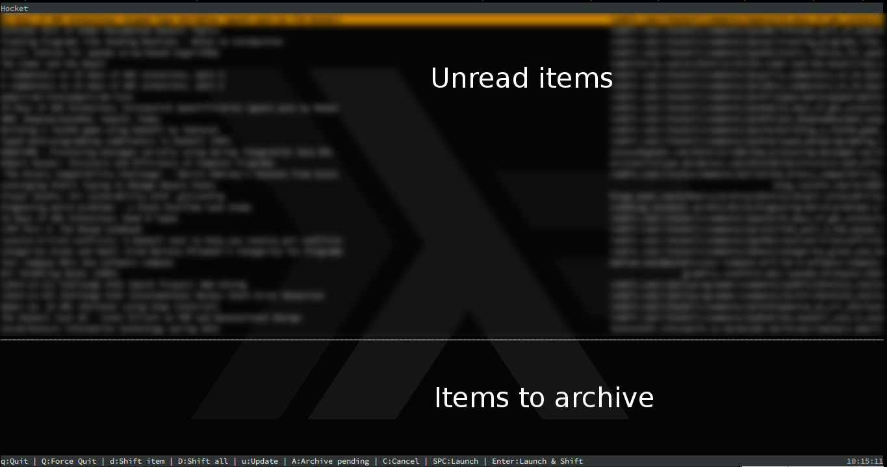

# Hocket

A minimalistic terminal user interface for [Raindrop.io](https://raindrop.io/) written in Haskell.


## Overview

Hocket provides a keyboard-driven terminal interface for efficiently managing your Raindrop.io bookmarks. It's designed for users who prefer command-line tools and want to quickly process their bookmark collection without leaving the terminal.



## Features

### Core Functionality
- **Single-pane interface with action flags** - View all items with visual indicators for pending actions
- **Real-time synchronization** - Fetch latest bookmarks from Raindrop.io
- **Batch operations** - Archive multiple items at once
- **Smart updates** - Only fetch items modified since last sync
- **Favorite indicators** - Visual markers (★) for favorite bookmarks
- **Rich item display** - Shows dates, titles, URLs, notes, and excerpts

### Command Line Interface
- **Add bookmarks from CLI** - Add bookmarks directly from terminal
- **Automatic metadata extraction** - Raindrop.io parses title and description automatically
- **Collection targeting** - Specify which collection to add bookmarks to
- **Tag support** - Add multiple tags when creating bookmarks
- **Robust error handling** - Automatic retries with exponential backoff

### Workflow Support
- **Browser integration** - Open bookmarks in your default browser
- **Archive management** - Move items to a designated archive collection
- **Keyboard navigation** - Efficient Vi-style navigation
- **Status tracking** - Visual feedback for all operations

## Installation

### Using Nix (Recommended)

```bash
# Build the project
nix build

# Run directly
nix run -- tui

# Install to your profile
nix profile install
```

### Using Cabal

```bash
# Clone the repository
git clone https://github.com/markus1189/hocket.git
cd hocket

# Build and install
cabal build
cabal install
```

## Configuration

Create a `config.dhall` file in your working directory:

```dhall
{
  _raindropToken = "your-raindrop-test-token-here",
  _archiveCollectionId = 12345
}
```

### Getting Your Raindrop.io Token

1. Visit [Raindrop.io Settings → Integrations](https://app.raindrop.io/settings/integrations)
2. Click **"+ Create new app"**
3. Name your app (e.g., "Hocket")
4. Click **"Create"**
5. Click on your new app
6. Copy the **"Test token"**

### Finding Your Archive Collection ID

1. Go to [Raindrop.io](https://app.raindrop.io)
2. Create or navigate to your desired archive collection
3. Note the collection ID from the URL (e.g., `app.raindrop.io/my/12345`)

**Security Note:** Keep your token secure and never commit it to version control.

## Usage

### Commands

#### Terminal User Interface
```bash
# Run the interactive TUI from the directory containing config.dhall
hocket tui
```

#### Add Bookmarks from Command Line
```bash
# Add a bookmark to the unsorted collection
hocket add https://example.com

# Add a bookmark to a specific collection
hocket add https://example.com --collection 12345

# Add a bookmark with tags
hocket add https://example.com --tag programming --tag tutorial

# Add a bookmark with collection and tags
hocket add https://example.com --collection 12345 --tag rust --tag cli
```

**Add Command Features:**
- **Automatic metadata extraction** - Title, description, and other metadata are fetched automatically
- **Default collection** - Uses unsorted collection (-1) if not specified
- **Multiple tags** - Add multiple `--tag` flags for multiple tags
- **Retry logic** - Automatically retries failed requests with exponential backoff
- **Error handling** - Clear error messages for configuration and API issues

### Keyboard Controls

#### Navigation
- `↑/↓` or `j/k` - Move up/down in the list
- `J/K` - Jump to next/previous flagged item (skip unflagged items)
- `q` - Quit application

#### Item Actions
- `Space` - Open selected item in browser
- `Enter` - Open item in browser AND mark for archiving
- `a` - Flag selected item for archiving
- `u` - Remove archive flag from selected item

#### Bulk Operations
- `r` - Refresh/fetch latest items from Raindrop.io
- `U` - Clear all flags from all items
- `X` - Execute archive operation on all flagged items

### Interface Layout

```
┌─ Hocket: (15|3) ────────────────────────────────────────┐
│   2025-01-15: ★ Important Article Title         reddit.com/r/... │
│   2025-01-14:   Regular Bookmark                github.com/...   │
│ A 2025-01-13:   Item flagged for archive        example.com/...  │
│   2025-01-12:   Another Item                    news.ycombinator...│
│ A 2025-01-11: ★ Favorite flagged for archive    stackoverflow.com/│
├──────────────────────────────────────────────────────────────────┤
└─ NOTE: This is a sample note from the selected item ──────────────┘
│                                                    Last: 14:32:18 │
│ Status: fetching since: 2025-01-14                                │
└────────────────────────────────────────────────────────────────────┘
```

#### Visual Elements
- **A** - Flag indicating item is pending archive action
- **★** - Indicates favorite bookmarks
- **Date** - When the bookmark was created
- **Title** - Bookmark title or URL if no title available
- **Domain** - Truncated URL showing the domain and path
- **Bottom section** - Shows notes or excerpts for the selected item
- **Status bar** - Last update time and current operation status

## Technical Details

### Architecture
- **Language**: Haskell (GHC 9.6+)
- **UI Framework**: [Brick](https://github.com/jtdaugherty/brick) (terminal UI library)
- **HTTP Client**: [Wreq](http://www.serpentine.com/wreq/) for API communication
- **Configuration**: [Dhall](https://dhall-lang.org/) functional configuration language
- **Concurrency**: Async operations for non-blocking UI

### API Integration
- **Raindrop.io REST API v1** - Full integration with bookmark management
- **Smart pagination** - Efficiently handles large bookmark collections  
- **Rate limiting** - Respects API limits with exponential backoff retry logic
- **Error handling** - Graceful degradation on network issues
- **Automatic metadata parsing** - Uses Raindrop's `pleaseParse` feature for rich bookmark data

### Data Management
- **Local state** - In-memory bookmark cache with smart updates
- **Conflict resolution** - Handles concurrent modifications
- **Performance** - Optimized for collections with thousands of items

## Development

### Building from Source

```bash
# Install dependencies
cabal update

# Build the project
cabal build

# Run tests
cabal test

# Development build with warnings
cabal build --ghc-options="-Wall -Werror"
```

### Project Structure

```
hocket/
├── main/                   # Main application
│   ├── hocket.hs          # Entry point and UI logic
│   └── Events.hs          # Event system definitions
├── src/Network/
│   ├── Raindrop.hs        # API client implementation
│   └── Bookmark/
│       ├── Types.hs       # Data types and JSON instances
│       └── Ui/
│           ├── State.hs   # Application state management
│           └── Widgets.hs # UI helper functions
└── test/                  # Test suite
```

### Contributing

Contributions are welcome! Please:

1. Follow the existing code style (see `CONVENTIONS.md`)
2. Add tests for new functionality
3. Update documentation as needed
4. Ensure `cabal test` passes

#### Code Style Guidelines
- Use `lens` for record access (avoid `_` prefixed accessors)
- Prefer `wreq` for HTTP operations
- Use `tasty` for testing
- Follow Brick patterns for UI components

## Limitations

Current limitations that may be addressed in future versions:

- **Single collection focus** - Primarily works with unsorted bookmarks
- **Browser dependency** - Requires external browser for opening links
- **Terminal only** - No GUI version available
- **Limited search** - No built-in search functionality

## Troubleshooting

### Common Issues

**"Authentication failed"**
- Verify your Raindrop.io token in `config.dhall`
- Ensure the token has not expired
- Check your internet connection

**"Collection not found"**
- Verify the `archiveCollectionId` in your config
- Ensure the collection exists and is accessible

**"Items not appearing"**
- Press `r` to refresh/fetch latest items
- Check that items exist in your Raindrop.io unsorted collection
- Verify your account has bookmarks

### Getting Help

- Check existing [GitHub Issues](https://github.com/markus1189/hocket/issues)
- Review the `CONVENTIONS.md` file for development guidelines
- Consult the [Brick documentation](https://github.com/jtdaugherty/brick/blob/master/docs/guide.rst) for UI-related questions

## License

BSD3 - See [LICENSE](LICENSE) file for details.

## Acknowledgments

- [Raindrop.io](https://raindrop.io/) for providing an excellent bookmark service with a great API
- [Brick](https://github.com/jtdaugherty/brick) for making terminal UI development in Haskell approachable
- The Haskell community for excellent libraries and tooling